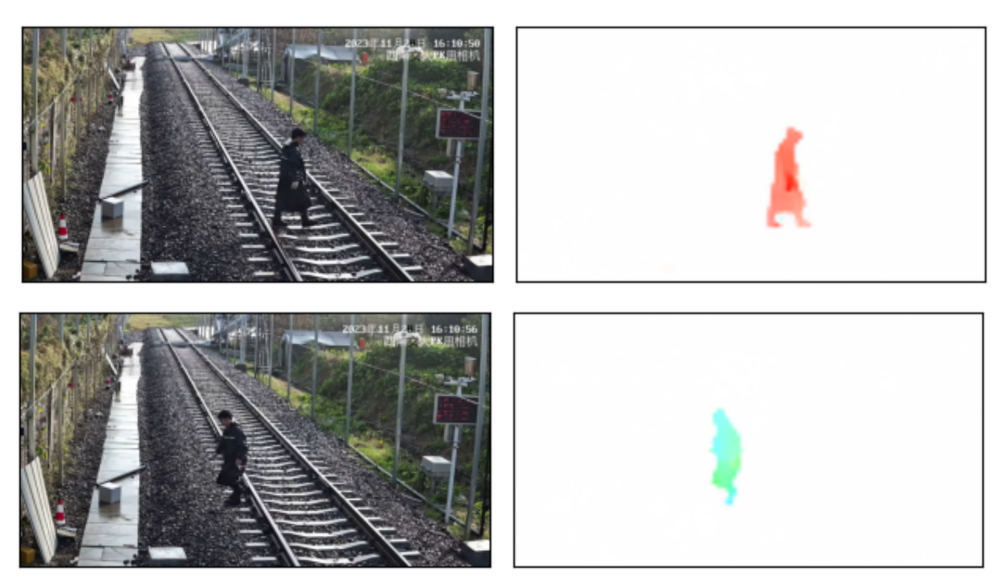
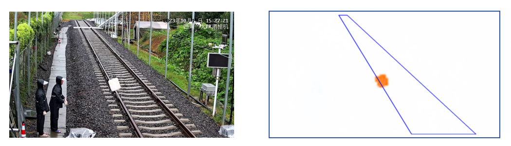

# optical-flow-csrd

## Introduction
This repository is about detecting intrusion in railway
scenario. Raft is used as our optical-flow model due to its
performance. 

The proposed approach can detect not only pedestrians, but also
moving objects.

## Usage
To generate single prediction from two images: 

`python demo.py single img_1_path img_2_path out_path`

To generate a gif from a batch of images:

`python demo.py gif image_folder_path out_path`
## Methods
The input consists of two consecutive frames from a video,
annotated as $I_{t_{1}}$ and $I_{t_{2}}$. where the time interval
is around 200ms. Label the intrusion area in advance, and a pre-define
a threshold $\theta$. Feeding the pair frames $I_{t_{i}}$ and $I_{t_{i+1}}$
to the model and calculate the total detected pixels inside the Intrusion area,
once the value is over the $\theta$, report it.

